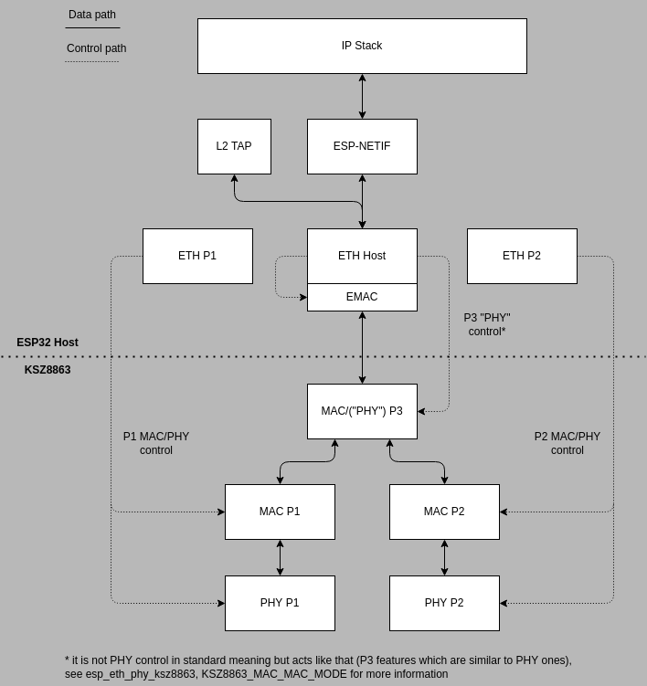
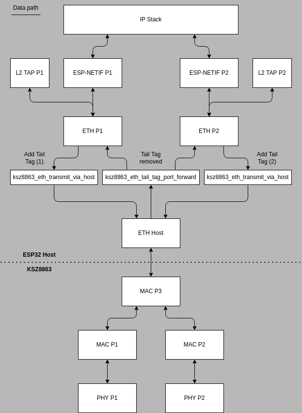

# KSZ8863 Ethernet Driver

## Overview

The KSZ8863MLL/FLL/RLL are highly integrated 3-port switch ICs in a small footprint.

They are designed to enable a new generation of low port count, cost-sensitive and power efficient 10/100Mbps switch systems. Low power consumption, advanced power management and sophisticated QoS features (e.g., IPv6 priority classification support) make these devices ideal for IPTV, IP-STB, VoIP, automotive and industrial applications. See [KSZ8863 product page](https://www.microchip.com/en-us/product/KSZ8863) for more information.

From IOT use cases point of view, one of the advantages of usage of this chip is to enable ring topology of Ethernet connected devices which would otherwise needed to be connected in tree topology. Tree topology usually requires extensive wiring since each device is connected to the central point (switch/router) by separate cable. On the opposite, ring topology can save wiring since the devices can be "daisy-chained" (each device in path can pass the traffic further to the final destination). Note that the ring may not be "closed".

## Driver Architecture

The KSZ8863 Espressif driver can be utilized in three modes of operation:
- simple switch
- managed switch
- to act as two separate endpoints

## KSZ8863 as Simple Switch

This is the simplest way of use the KSZ8863 driver. It is completely transparent from user point of view since the KSZ8863 is initialized and used like any other Ethernet device currently supported by the ESP-IDF. The system behaves the same as the ESP32 Ethernet interface was connected to external switch. You have no tail tagging option, i.e. you cannot specifically define where to send Ethernet frame and all routing is performed in KSZ8863 based on its internal MAC lookup tables. On the other hand, you still have an option to configure the KSZ8863, if you need so. To be able to control the configuration of P1 and P2 ports (MACs or PHYs), ESP Ethernet handles associated with these ports need to be initialized. You get also an access to the port state (link status, speed, etc.).

---

Warning:

In this **Simple Switch** configuration, KSZ8863 cannot be used in a way you connected both P1 & P2 to the same switch at psychical layer or in networks with presence of redundant paths because there is a risk of creation of Ethernet Loops (Broadcast storms). Refer to [this post](https://www.networkacademy.io/ccna/ethernet/an-switching-redundant-links) to see details and implications.

---

The figure below shows data and control flow in this mode. Notice that P1 and P2 Ethernet handles are not utilized for data path and serve only to access the control of these ports. See [KSZ8863 Control and Configuration section](#ksz8863-control-and-configuration) for more information.

## KSZ8863 as Managed Switch

This is more advanced configuration of KSZ8863 driver. It behaves as switch but enables Tail Tagging and so ensures greater control over network topology. It is specifically intended to be used with Spanning Tree protocols where you need to be able to know at which port the protocol message (BPDU) was received and to have control over which port to be sent.

The Tail Tagging is not available directly to user's code (user does not have to add the Tail Tag at end of the frame, for instance). It is available indirectly via L2 TAP interface. The L2 TAP interface is bound to a specific KSZ8863 port Ethernet handle and then the traffic received/transmitted at this L2 TAP interface is tagged under the hood by the driver. For example, if user reads a frame using L2 TAP file descriptor associated with P1, it means the frame was tagged by KSZ8863 and source was port 1. Note that the driver removes the Tail Tag prior passing the frame to upper layers (e.i. to L2 TAP or ESP NETIF). At transmit side when user sends a frame via L2 TAP file descriptor associated with P1, the frame is tail tagged by driver and provided to KSZ8863 via Host port. This approach has an implication/limitation that tail tagging is available only for non-IP traffic by default. IP traffic is always routed based on internal lookup in KSZ8863 based on configuration of its MAC tables (transmit frame is tail tagged with "`0`").

---

Warning:

In this **Managed Switch** configuration, KSZ8863 cannot be used in a way you connected both P1 & P2 to the same switch at psychical layer or in networks with presence of redundant paths because there is a risk of creation of Ethernet Loops (Broadcast storms) **unless Host processor implements Spanning Tree and disables traffic at port which creates redundancy in the network**. Refer to [this post](https://www.networkacademy.io/ccna/ethernet/an-switching-redundant-links) to see details and implications.

---

The figure below shows data path when KSZ8863 is used in this Managed Switch mode. The control path is the same as presented in Simple Switch mode and is not shown here deliberately to emphasize data path which is more complex. Also see [KSZ8863 Control and Configuration section](#ksz8863-control-and-configuration) for additional information. Data flow directions are important since receive and transmit path are not symmetric for IP traffic.

### KSZ8863 Intermediate Layer Functions Description

- `ksz8863_eth_tail_tag_port_forward` - removes Tail Tag and forwards the frame to appropriate port Ethernet handle based on it.
- `ksz8863_eth_transmit_via_host` - sends frame via Host Ethernet interface to the KSZ8863 with appropriate Tail Tag.
- `ksz8863_eth_transmit_normal_lookup` - sends frame via Host Ethernet interface to the KSZ8863 with appropriate Tail Tag

## KSZ8863 as Two Port Endpoints

Also called "Port Mode" is intended to give to ESP32 feature of two independent Ethernet interfaces. Each KSZ8863 port acts as separate endpoint with its specific MAC address, has its own NETIF instance and no traffic is exchanged between P1 and P2 inside KSZ8863. This mode takes full advantage of Tail tagging. Since the ports act independently, the KSZ8863 can be used in network configuration where P1 & P2 are connected to the same switch at psychical layer or in networks with presence of redundant paths because there is no risk of creation of Ethernet Loops (Broadcast storms). Refer to [this post](https://www.networkacademy.io/ccna/ethernet/an-switching-redundant-links) to see details and implications.

The figure below shows data path when KSZ8863 is used in this Port Mode. The control path is the same as presented in Simple Switch mode. See [KSZ8863 Control and Configuration section](#ksz8863-control-and-configuration) for more information.

### Port Mode Known Limitations

- To keep the ports separated and due to a fact that there is no option to generally configure multicast forwarding in KSZ8863, **Multicast traffic is not forwarded to Host port** by default. Workaround: either configure KSZ8863 to promiscuous mode via ``esp_eth_ioctl`` or add a record to static MAC table with that multicast address forwarded to P3.
- The first Static MAC table entry (index. 0) is not allowed to be modified in this mode using ``esp_eth_ioctl`` since it is used internally by the driver.

## KSZ8863 Configuration & Control interface

KSZ8863 can be managed via either I2C or SPI bus. SMI is not supported.

SMI used in KSZ8863 is a non-standard implementation of IEEE 802.3 MII management interface (MIIM). The core differences are the unusual addressing method used to get access to the full set of KSZ8863's registers and opcode numbering (MIIM sends opcode `0b10` to read and `0b01` to write, SMI expects `0b00` for both). It is impossible for ESP32 to produce opcode `0b00` by design, since it follows IEEE 802.3 MII management interface specification.

### KSZ8863 Control and Configuration

Some MAC layer related configuration (like MAC tables configuration) is common for all ports and so can be accessed by both P1 or P2 Ethernet handles, just choose one to perform these operation. Configuration features which can be accessed this way can be generally identified as `Global Control` registers in KSZ8863 datasheet.

The P3 port, which is also called as Host port in this driver (or sometimes Switch port in KSZ8863 datasheet) does not consist of any actual PHY but some of its configuration features can be handled in PHY like style from ESP32 Host EMAC point of view (e.g. speed, duplex, etc.). Therefore these features are accessible via Host Ethernet handle and P3 acts as PHY instance, see `esp_eth_phy_ksz8863`, mode `KSZ8863_MAC_MAC_MODE` for more information. Accessing MAC related features of P3 is currently not fully possible, however, it is not needed in majority of cases anyway since the P3 can be understood as a generic data gateway to KSZ8863 which does not require any specific handling and some of the features can be accessed globally via P1 or P2 as described above.
