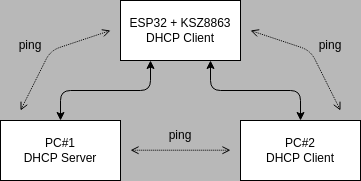

| Supported Targets | ESP32 |
| ----------------- | ----- |

# KSZ8863 Simple Switch Example

## Overview

This example demonstrates initialization and basic usage of KSZ8863 driver in **Simple Switch Mode**. See the README.md file in the upper level directories to learn more about this mode.

## How to use example

You need one ESP32 with KSZ8863 and two PC's (or other Ethernet capable devices). Connect the network as shown in figure below, configure PC#1 as DHCP server and PC#2 as DHCP client.



The work flow of the example is then as follows:

1. Install the KSZ8863 Ethernet driver in ESP32.
2. Wait for a DHCP leases in ESP32 and PC#2.
3. If get IP addresses successfully, then you will be able to ping the ESP32 device and PC#2 from PC#1 (and vice versa).
4. You will be able to receive **the same "L2 Test message"** in PC#1 and PC#2 (use ``Wireshark`` or ``tcpdump``).

### Configure the project

Configure pin assignment, control interface and RMII REFCLK as per your board needs.

```
idf.py menuconfig
```

For more information, see help associated with each option in ESP-IDF Configuration tool.

### Build, Flash, and Run

Build the project and flash it to the board, then run monitor tool to view serial output:

```
idf.py -p PORT build flash monitor
```

(Replace PORT with the name of the serial port to use.)

(To exit the serial monitor, type ``Ctrl-]``.)

See the [Getting Started Guide](https://docs.espressif.com/projects/esp-idf/en/latest/get-started/index.html) for full steps to configure and use ESP-IDF to build projects.

## Example Output

**ESP32 with KSZ8863 output:**

```bash
I (453) simple_switch_example: Ethernet Link Up
I (453) simple_switch_example: Ethernet HW Addr 8c:4b:14:0a:14:63
I (2553) simple_switch_example: Ethernet Started
I (2553) simple_switch_example: Ethernet Link Up Port 1
I (2553) simple_switch_example: Ethernet HW Addr 00:00:00:00:00:00
I (4653) simple_switch_example: Ethernet Started
I (4653) simple_switch_example: Ethernet Link Up Port 2
I (4653) simple_switch_example: Ethernet HW Addr 00:00:00:00:00:00
I (4663) simple_switch_example: Dynamic MAC Table content:
I (4663) simple_switch_example: valid entries 2
I (4663) simple_switch_example: port 1
I (4673) simple_switch_example: 00 e0 4c 68 01 ac
I (4673) simple_switch_example: port 3
I (4683) simple_switch_example: 8c 4b 14 0a 14 63

I (5903) esp_netif_handlers: eth ip: 192.168.20.105, mask: 255.255.255.0, gw: 192.168.20.1
I (5903) simple_switch_example: Ethernet Got IP Address
I (5903) simple_switch_example: ~~~~~~~~~~~
I (5903) simple_switch_example: ETHIP:192.168.20.105
I (5913) simple_switch_example: ETHMASK:255.255.255.0
I (5923) simple_switch_example: ETHGW:192.168.20.1
I (5923) simple_switch_example: ~~~~~~~~~~~
```
**PC#2 output (on Linux OS):**

```bash
$ ip a

...

2: enp4s0: <BROADCAST,MULTICAST,UP,LOWER_UP> mtu 1500 qdisc fq_codel state UP group default qlen 1000
    link/ether 70:85:c2:d3:ea:18 brd ff:ff:ff:ff:ff:ff
    inet 192.168.20.116/24 brd 192.168.20.255 scope global dynamic noprefixroute enp4s0
       valid_lft 346sec preferred_lft 346sec
    inet6 fe80::4efa:2bae:e58c:231e/64 scope link noprefixroute
       valid_lft forever preferred_lft forever

...
```

Now you can ping your ESP32 in PC#1 terminal by entering `ping 192.168.20.105` and PC#2 in PC#1 terminal by entering `ping 192.168.20.116` (it depends on the actual IP address you get).

You can also check the received test message in PC#1 or PC#2 as follows (on Linux OS):

```bash
$ sudo tcpdump -i enp4s0

dropped privs to tcpdump
tcpdump: verbose output suppressed, use -v[v]... for full protocol decode
listening on enp4s0, link-type EN10MB (Ethernet), snapshot length 262144 bytes
11:16:12.576802 8c:4b:14:0a:14:63 (oui Unknown) > Broadcast, ethertype Unknown (0x7000), length 60:
	0x0000:  0000 5468 6973 2069 7320 4553 5033 3220  ..This.is.ESP32.
	0x0010:  4c32 2054 4150 2074 6573 7420 6d73 6700  L2.TAP.test.msg.
	0x0020:  0000 0000 0000 0000 0000 0000 0000       ..............
```
Note: replace "enp4s0" with actual name of your Ethernet interface.
