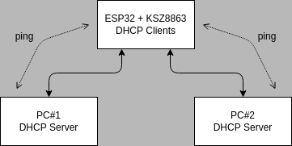
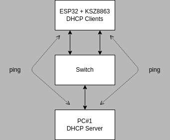

| Supported Targets | ESP32 |
| ----------------- | ----- |

# KSZ8863 Port Mode Example

## Overview

This example demonstrates initialization and basic usage of KSZ8863 driver in **Port Mode**. See the README.md file in the upper level directories to learn more about this mode.

## How to use example

You will either need one ESP32 with KSZ8863 and two PC's (or other Ethernet capable devices). Or you will need one ESP32 with KSZ8863, one PC (or other Ethernet capable device) and one Ethernet switch. In the first case, connect the network as shown in figure below, configure PC#1 and PC#2 as DHCP servers.



In the second case, connect the network as shown in figure below, configure PC#1 as DHCP server.



The work flow of the example is then as follows:

1. Install the KSZ8863 Ethernet driver in ESP32.
2. Wait for a DHCP leases in ESP32.
3. If get IP addresses successfully, then you will be able to ping each port of ESP32 device.
4. You will be able to receive **different "L2 Test messages"** from each ESP32 device port (use ``Wireshark`` or ``tcpdump``).

### Configure the project

Configure pin assignment, control interface and RMII REFCLK as per your board needs.

```
idf.py menuconfig
```

For more information, see help associated with each option in ESP-IDF Configuration tool.

### Build, Flash, and Run

Build the project and flash it to the board, then run monitor tool to view serial output:

```
idf.py -p PORT build flash monitor
```

(Replace PORT with the name of the serial port to use.)

(To exit the serial monitor, type ``Ctrl-]``.)

See the [Getting Started Guide](https://docs.espressif.com/projects/esp-idf/en/latest/get-started/index.html) for full steps to configure and use ESP-IDF to build projects.

## Example Output

**ESP32 with KSZ8863 output:**

```bash
I (475) ksz8863_eth_example: Ethernet Link Up
I (475) ksz8863_eth_example: Ethernet HW Addr 8c:4b:14:0a:14:63
I (2285) ksz8863_eth_example: Ethernet Started
I (2285) ksz8863_eth_example: Ethernet Link Up Port 1
I (2285) ksz8863_eth_example: Ethernet HW Addr 8c:4b:14:0a:14:00
I (3905) esp_netif_handlers: eth0 ip: 192.168.20.107, mask: 255.255.255.0, gw: 192.168.20.1
I (3905) ksz8863_eth_example: Ethernet Got IP Address
I (3905) ksz8863_eth_example: ~~~~~~~~~~~
I (3905) ksz8863_eth_example: ETHIP:192.168.20.107
I (3915) ksz8863_eth_example: ETHMASK:255.255.255.0
I (3925) ksz8863_eth_example: ETHGW:192.168.20.1
I (3925) ksz8863_eth_example: ~~~~~~~~~~~
I (4085) ksz8863_eth_example: Ethernet Started
I (4085) ksz8863_eth_example: Ethernet Link Up Port 2
I (4085) ksz8863_eth_example: Ethernet HW Addr 8c:4b:14:0a:14:01

...

I (5905) esp_netif_handlers: eth1 ip: 192.168.20.106, mask: 255.255.255.0, gw: 192.168.20.1
I (5905) ksz8863_eth_example: Ethernet Got IP Address
I (5905) ksz8863_eth_example: ~~~~~~~~~~~
I (5905) ksz8863_eth_example: ETHIP:192.168.20.106
I (5915) ksz8863_eth_example: ETHMASK:255.255.255.0
I (5925) ksz8863_eth_example: ETHGW:192.168.20.1
I (5925) ksz8863_eth_example: ~~~~~~~~~~~
```
Now you can ping your ESP32 in PC#1 terminal by entering `ping 192.168.20.106` and  `ping 192.168.20.107` (it depends on the actual IP address you get).

You can also check the received test message in PC#1 as follows (on Linux OS and example connected to network with switch):

```bash
$ sudo tcpdump -i enp4s0
dropped privs to tcpdump
tcpdump: verbose output suppressed, use -v[v]... for full protocol decode
listening on enp4s0, link-type EN10MB (Ethernet), snapshot length 262144 bytes
13:39:00.358089 8c:4b:14:0a:14:00 (oui Unknown) > Broadcast, ethertype Unknown (0x7000), length 60:
	0x0000:  0000 5468 6973 2069 7320 4553 5033 3220  ..This.is.ESP32.
	0x0010:  4c32 2054 4150 2074 6573 7420 6d73 6720  L2.TAP.test.msg.
	0x0020:  6672 6f6d 2050 6f72 743a 2031 0000       from.Port:.1..
13:39:00.358089 8c:4b:14:0a:14:01 (oui Unknown) > Broadcast, ethertype Unknown (0x7000), length 60:
	0x0000:  0000 5468 6973 2069 7320 4553 5033 3220  ..This.is.ESP32.
	0x0010:  4c32 2054 4150 2074 6573 7420 6d73 6720  L2.TAP.test.msg.
	0x0020:  6672 6f6d 2050 6f72 743a 2032 0000       from.Port:.2..
```
Note: replace "enp4s0" with actual name of your Ethernet interface.
